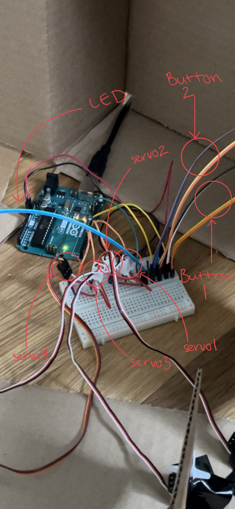
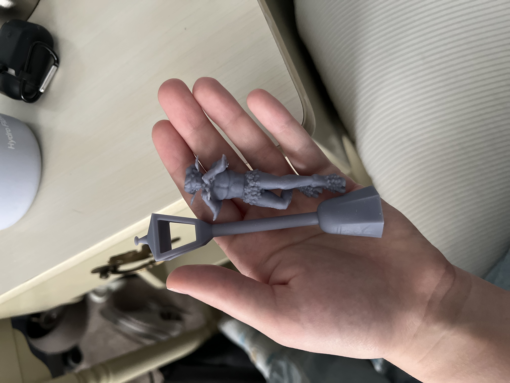

# Physical Media
Though a large portion of this repository is dedicated to documenting our coding process, equally important to the project are the physical mediums it manifested through. There are two broad categories for the physical apsects of this project: the wiring and Arduino hardware, and the set design of the diorama. Here, we will mostly be discussing the development of these aspects separately, as they didn't come together until towards the end of the project. If you want to see everything working together in action, check out our [video](unit2 project vid.mp4) included in this repository. 

Alt text image descriptions are provided.

## Arduino Build
I (Emme) took the lead on the Arduino coding and wiring portion of this project. Because of the iterative nature of revising code (the details of which can be found in [this file](codeHistory.md)), the hardware and our wiring evolved over the course of the project. 

From our brainstorming, we knew that we would want to use servo motors to open and close the doors of a wardrobe and have an LED for the iconic Narnia lamppost. Wiring an LED light seemed more straightforward, so we started with getting the servo motors working. The first tutorial we followed for coding and wiring was to use a button to move a servo motor, and since we knew that we would have double doors on the wardrobe, we quickly added a second servo motor (Fig 1).

  
     
*Fig 1. Our first iteration of wiring, which included two servo motors and one button to move them. This was a good start, but the wiring was too messy to be sustainable, especially as we continued to add elements, so we ended up completely redoing this same setup to look nicer.*

Adding the LED light for the lamppost felt like the next logical step in our process (Fig 2), and we chose a yellow LED so that it wasn't obviously a colorful light, but it felt warmer and more vintage than a harsh white. When I rewired everything for this set up, I organized the wires more neatly."

 
     
*Fig 2. We've now added an LED, so we're one step closer to having all the pieces we would need for our final project. The wiring is also much neater now, primed for adding more buttons and servo motors.*

While the code still had a ways to go before it was ready, the hardware really only had two more things to add: a second button (Fig 3) and two more servo motors for the other set of doors on the wardrobe (Fig 4).

 
     
*Fig 3. Adding the second button was a very small change on the breadboard, but instrumental for our final project.*

 
     
*Fig 4. All of the hardware we need for the project is now hooked up. We knew for the final project that we would need the hardware to have greater range, so at this point the buttons and the LED light have been put on extension wires. We later added extension wires to the servo motors as well.*

## The Scene
Helen was the lead in designing and building the diorama portion of this assignment. The basis of our project was a cardboard box, which they used felt, glitter, miniatures from Michael's, and paint to decorate. They also 3D printed two objects in resin on a personal 3D printer: the lamppost and the faun, Mr. Tumnus (Fig 5). The designs for these assets were posted on UltiMaker Thingiverse. Mr. Tumnus used a design called [Male Satyr](https://www.thingiverse.com/thing:3063960), posted by mrhers2 on August 23, 2018, and the lamppost came from a design titled [Street lamp (Réverbère)](https://www.thingiverse.com/thing:3641049), uploaded by Aspect50 on May 19, 2019.

*Fig 5. Our 3D printed assets, printed on a personal resin 3D printer.*

These assets were painted using arylic paint and added to the set (Fig 6). The scene includes a false floor with a hill at the back which we used to hide the Arduino, breadboard, and wires. Holes have been cut in the floor for the LED  wires to go through as well as the arms of the motors. The doors have not yet been attached as this was before we combined our work. 

 
     
*Fig 6. (left) A front view of our scene before any wiring was done and the doors were attached. (right) A birds eye view of the same scene; here the empty space at the front of the box is more visible -- this space will become the inside of the wardrobe.*

## Combining the components
At this point, our individual pieces were complete and needed to be put together. As mentioned, the Arduino, breadboard, and wiring went under the hill at the back of the box, and the false floor provided room for our wires and motors to be hidden. The arms of the motors poked through the floor and we hotglued the doors to them. Here, we had to make some adjustments because our measurements hadn't been exact and we needed to make sure that pieces weren't hitting each other when they moved. These were minor changes such as trimming back the felt in one area and trimming a very small amount off the tops of the front doors. We also had to put the wiring for the LED light through the lamppost, which proved to be a little too narrow for both wires, but we managed to simply hide the other one behind the lamppost without issue. The final step of combining our pieces was to cut holes in the side of the box for the buttons, which Helen then labeled for clarity. 

The final build: 

